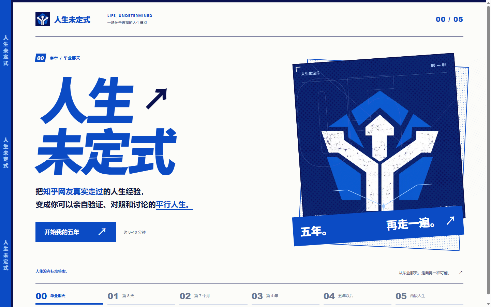
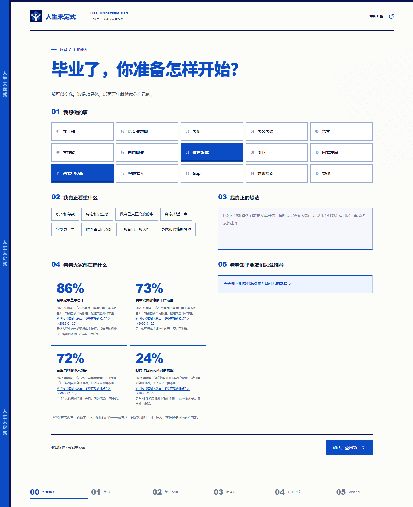
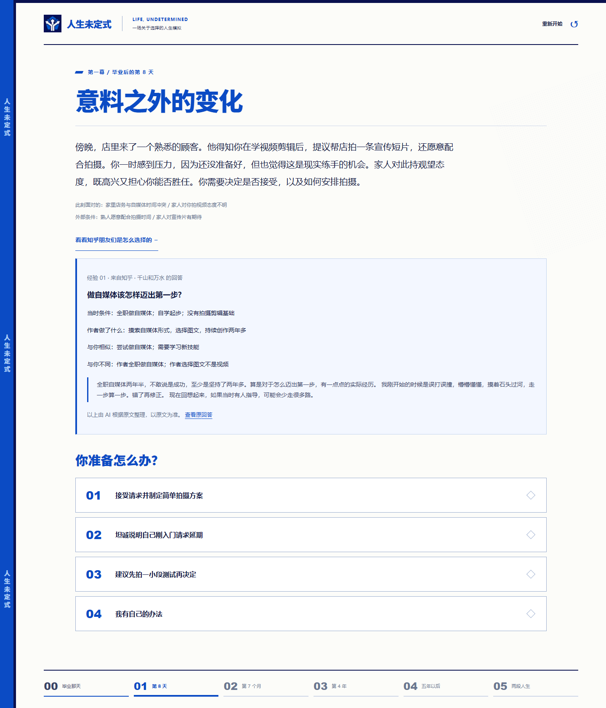
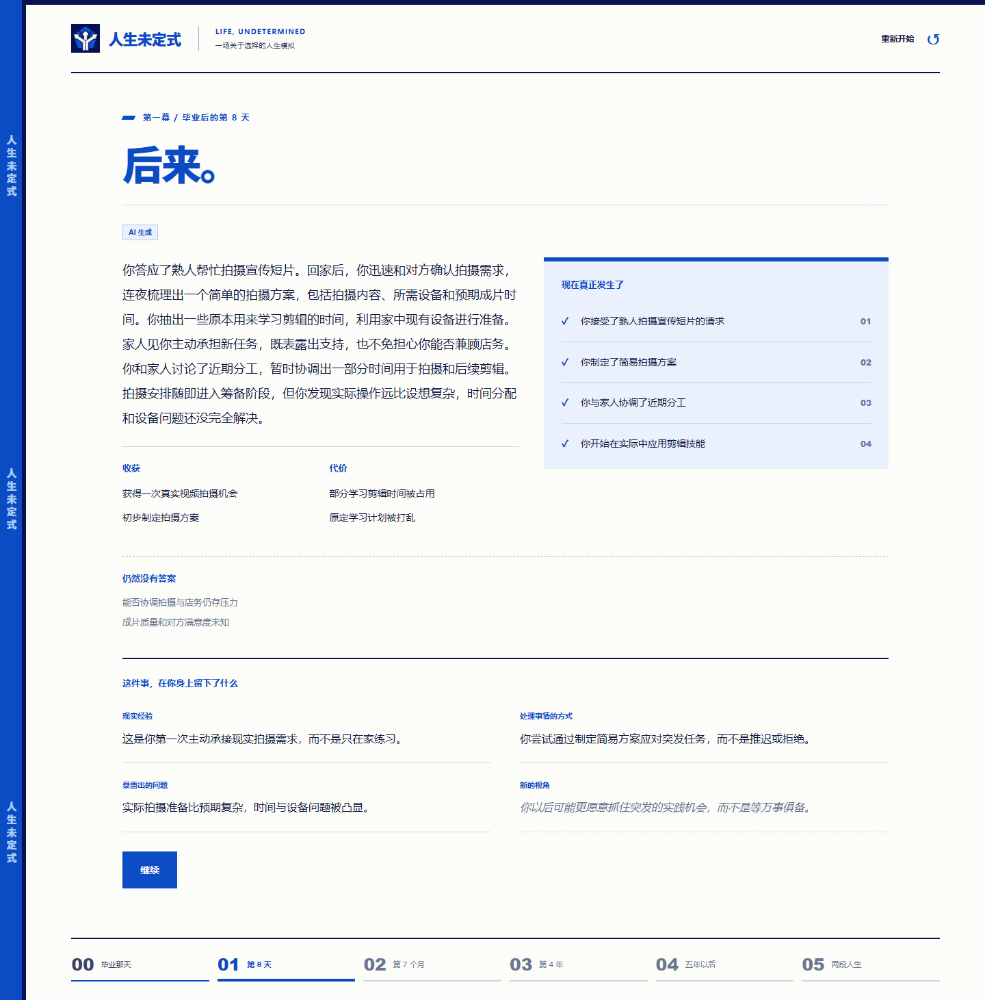
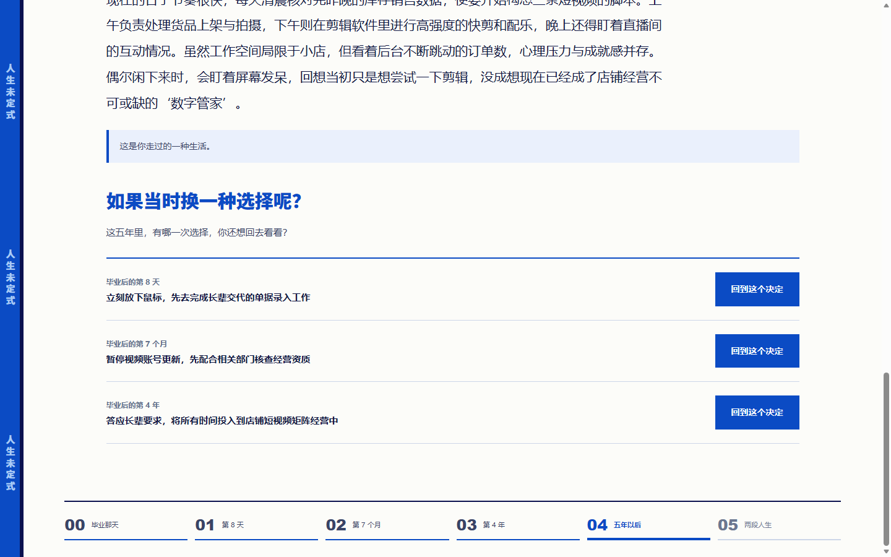
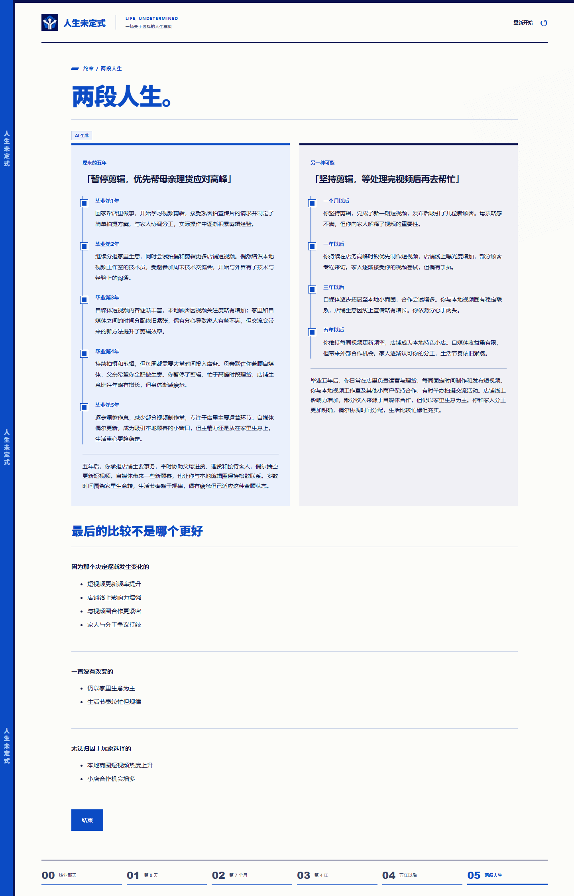
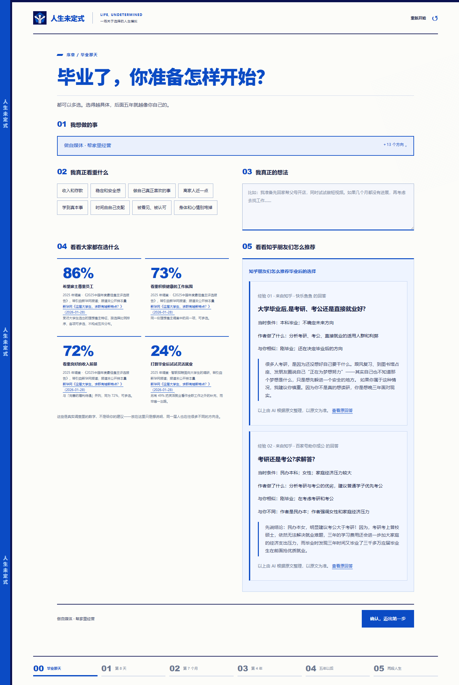
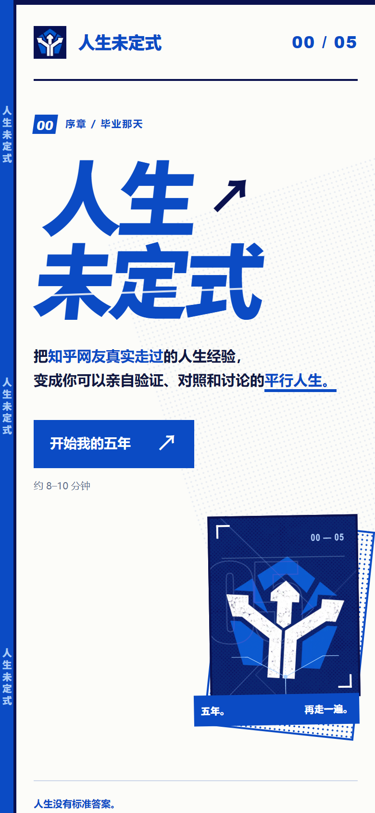

<div align="center">

# 人生未定式 · Life, Undetermined

**把知乎网友真实走过的人生经验，变成你可以亲自验证、对照和讨论的平行人生。**

*毕业后的五年，你可以走两遍。*

### ▶ [indeterminate.eilnoctis.com](https://indeterminate.eilnoctis.com)

单局约 8–10 分钟 · 手机可玩 · 用知乎账号登录后开始

2026 知乎黑客松 · 游戏赛道参赛作品

</div>



---

## 目录

- [这是什么](#这是什么)
- [为什么做这个](#为什么做这个)
- [玩法全览](#玩法全览)
- [和知乎生态的结合](#和知乎生态的结合)
- [几个刻意的设计决定](#几个刻意的设计决定)
- [架构](#架构)
- [回溯是怎么做对的](#回溯是怎么做对的)
- [失败与降级](#失败与降级)
- [本地运行](#本地运行)
- [项目结构](#项目结构)
- [内容来源与声明](#内容来源与声明)

---

## 这是什么

一个关于「毕业后该怎么选」的互动叙事游戏。

你做三次选择——**第 8 天**、**第 7 个月**、**第 4 年**——看着它们长成五年的人生；然后**回到其中任意一次决定**，换一个做法，把两段人生并排放在一起看。

每一个要做决定的时刻，都能调出知乎上过来人的**真实回答**：带作者、带原问题、带可点击的原文链接。

它不给答案，也不评判哪条路更好。

---

## 为什么做这个

「毕业后该找工作还是考研」「要不要回家」「自媒体能做吗」，是知乎上最密集的一类提问。

这类问题的真实困难**不是缺少建议**——建议太多了——而是三件事：

| 困难 | 这个作品怎么处理 |
|---|---|
| **建议是别人的语境。** 回答者的家庭、专业、经济条件和你不一样，结论却常被当成通用答案。 | 每张知乎卡片都强制写出「**与你不同**」，直接点破不能照搬的地方。 |
| **代价是看不见的。** 你读得到「我选了 A，现在挺好」，读不到「选 A 的那五年里，B 那边会发生什么」。 | 每个结果同时写下**收获、代价、仍然没有答案的部分**，并且可以真的去看 B 那条线。 |
| **没有人能真的重来一次。** 而「如果当时……」恰恰是这件事上最强的情绪。 | 三次决定**每一次都能回去**，换一个选择重新推演到第五年。 |

---

## 玩法全览

### 序章 · 毕业那天



四块内容排在一屏里：

1. **我想做的事**——15 个方向（找工作 / 跨专业求职 / 考研 / 考公考编 / 留学 / 学技能 / 自由职业 / 做自媒体 / 创业 / 回家发展 / 帮家里经营 / 照顾家人 / Gap / 兼职探索 / 其他），可多选。
2. **我真正看重什么**——收入和存款、稳定和安全感、做自己真正喜欢的事、离家人近一点、学到真本事、时间由自己支配、被看见被认可、身体和心情别垮掉。这一项直接写进 `Intent.priorities`，会影响后面所有推演。
3. **我真正的想法**——用你自己的话写。AI 把它整理成结构化的「打算」，**复述给你确认**，确认后才开始推演。
4. **看看大家都在选什么**——来自公开调查的真实数字（见[数据的处理](#数据的处理)）。
5. **看看知乎朋友们怎么推荐**——**进入序章即自动检索**知乎上过来人的真实回答，不需要点击。

### 三次选择 · 第 8 天 / 第 7 个月 / 第 4 年

每一幕结构固定：

**① 两种可能** — 「顺势发展的可能」与「意料之外的变化」，一次请求同时生成两个完整情境，你选一个走进去。

**② 具体情境** — 不是抽象的人生岔路，是一个具体的下午：

> 午餐高峰刚结束，老顾客张叔带着新开的水果店名片来找你，说听说你在学拍摄，问能不能帮他录一段短视频宣传。他希望你本周内完成……你的家人对此感到新奇，但也提醒你本周是旺季。



情境页随时可以**看看知乎朋友们是怎么选择的**，调出与当前处境相关的真实经验。

**③ 你准备怎么办** — 几个具体行动，也可以写自己的办法。

**④ 后来** —



分成两层（这个区分是刻意的，见[设计决定](#发生了什么和留下了什么是两层)）：

- **现在真正发生了**——既成事实，写进权威状态，后面的剧情必须建立在它之上。
- **这件事，在你身上留下了什么**——处理事情的方式、新的视角、对自己的了解、人际与沟通、现实经验、资源与机会、付出的代价、暴露出的问题、第一次。

### 五年以后

时间加速五年，你在同学聚会上被问「你现在平时都在做什么」。屏幕上是你五年的时间线，和五年前你自己写下的那段话。

### 回溯 · 每一次决定都能回去



这是这个作品的核心机制。三次选择**每一次都可以回去**——不只是最后那次。

### 两段人生



两条时间线并排，下面分成三栏：

- **因为那个决定逐渐发生变化的**
- **一直没有改变的**
- **无法归因于你选择的**

第三栏是刻意留的：有些事和你的选择无关，它就是发生了。

> **最后的比较不是哪个更好。**

---

## 和知乎生态的结合

这是这个作品的核心，不是装饰功能。

### 真实内容，不是「AI 扮演知乎用户」



所有知乎卡片都来自真实检索结果，每张保留：

- **作者名**（如「快乐鱼鱼 的回答」「管家老二 的文章」）
- **原问题或原文章标题**
- **可点击的原文链接**

检索不到足够相关内容时，AI 补充的参考思路会被**明确标注「AI 参考思路 · 非知乎内容」**，绝不混进知乎卡片里冒充真人经验。这是硬规则，写在代码里，也写在测试里。

### 铺在流程前段，而不是结尾的「相关阅读」

知乎内容出现在两个位置，都是玩家**正在做决定**的时刻：

| 位置 | 检索什么 | 触发方式 |
|---|---|---|
| **序章**（决定方向之前） | 过来人怎么建议毕业后的选择 | **进入即自动加载** |
| **每一幕的情境页**（决定行动之前） | 与当前具体处境相关的经验 | 一次点击展开 |

序章那一处是刻意独立出来的。早期版本按玩家勾的具体路径去找「走过这条路的人」，但**真正走过同一条路的人很少**，检索质量很差。改成「过来人怎么建议选」之后，覆盖面和相关度都明显变好。

### 结构化重述，降低阅读成本

原文常常几千字。每张卡片压成玩家在那一刻真正需要的五项：

- **当时条件**——作者当时的处境
- **作者做了什么**
- **后来发生什么**
- **与你相似**——为什么这条经验对你成立
- **与你不同**——为什么不能照搬

**「与你不同」是刻意加的**：它直接对抗开头说的第一个困难——把别人语境下的结论当成通用答案。

---

## 几个刻意的设计决定

### 没有分数、等级、徽章、经验条

整个作品里没有任何一处给你的人生打分。没有成就解锁，没有「+5 沟通能力」，没有升级动画。

理由很简单：**一旦引入分数，「哪条路更好」就有了答案**，而这个作品的全部主张是它没有。

### 「发生了什么」和「留下了什么」是两层

- **Facts（硬状态）**——写进权威状态，不可撤销，后续推演必须建立在其上。
- **Reflection（软状态）**——每一条都必须能追溯到上面的具体事实。

第二层有严格约束：

- **不写鸡汤**，有明确的禁用表达清单
- **不总结「你是一个怎样的人」**——AI 不定义玩家的人格
- 区分三种时间尺度：**当下 / 持续 / 可能**
- 「可能」那一档必须用概率表达，并在界面上**弱化呈现**（更浅、斜体）——因为它还没发生

一条真实输出：

> **处理事情的方式 · 持续**
> 这是你第一次主动与家人协商工作分配，*而不是*默默承担全部或回避。
>
> **新的视角 · 可能**
> *你以后遇到家庭和个人目标冲突时，也许更愿意提前协商分工。*

### 等待是设计对象，不是缺陷

五年加速最短 5 秒，回溯最短 7 秒。这两处**不做成加载转圈，也不缩短**——时间流逝需要被感觉到。

### 数据的处理

「看看大家都在选什么」只放**能核实来源的数字**，每个都标注年份、调查名称、来源媒体和可点击的原文链接。

拿不到合规来源时显示「**暂无已验证数据**」，**不编造百分比**；也不把几个独立的多选比例拼成一个看起来完整的饼图——那四个数字来自可多选题目，加起来超过 100%，测试里专门有一条断言防止后来的人把它改回「分布」。

---

## 架构

### 客户端是权威，后端是无状态的

整局 GameState 存在浏览器 `localStorage`，**状态机跑在浏览器里**。两个 API 路由只是带密钥的代理与校验器，不持有任何会话。刷新恢复靠本地存档。

```
浏览器                                    服务端（无状态）
┌──────────────────────────┐             ┌─────────────────────┐
│  GameState (localStorage)│             │  /api/v1/ai         │
│  ┌────────────────────┐  │  候选内容    │   4 种 operation    │
│  │ Game State Engine  │◄─┼─────────────┤   提示词 + 规范化    │
│  │  唯一的权威         │  │             │                     │
│  └────────────────────┘  │             │  /api/v1/zhihu      │
│           ▲              │             │   检索 + 相关度排序   │
│           │ 只有引擎能改  │             └─────────────────────┘
│      React 界面           │
└──────────────────────────┘
```

### AI 只提供候选内容，状态机才能改变权威状态

模型输出要穿过两层：

1. **宽松 schema** 先接住——容忍模型的格式波动
2. **规范化**——补 ID、时间戳、因果证据，裁剪超长字段，归一化枚举别名
3. **严格的领域 schema** 做最终闸门——过不了就**拒绝写入**

因果完整性也在这一层校验：每条既成事实必须声明它**由哪个决定引起**、**依赖哪些更早的事实**。这是回溯能够成立的前提。

### 状态流转

```
CREATED → INTENT_CONFIRMED → ┌─ SITUATION_READY → DECISION_RECORDED → OUTCOME_RESOLVED ─┐
                             └──────────────── ×3（第 8 天 / 第 7 个月 / 第 4 年）────────┘
  → LONG_TERM_READY → REUNION_READY → OPEN_FORK → FORK_READY → COMPARISON_READY → COMPLETED
```

---

## 回溯是怎么做对的

回溯最容易做错的地方是：**回到第 8 天时，第 7 个月和第 4 年发生的事必须不存在，而不是被忽略。**

做法是：**每一次决定被记录时，同时保存一份决策前快照**——当时的打算 + 当时已经发生的全部事实。三次决定，三份快照，与决定一一对应。

| 回到 | 快照里的既成事实 |
|---|---|
| 第 8 天 | 0 条 |
| 第 7 个月 | 1 条（第一幕的结果） |
| 第 4 年 | 2 条（前两幕的结果） |

快照由程序从权威状态**确定性地构建，不经过 AI**。引擎会校验它确实对应那一次决定、事实列表确实等于决策前的状态，对不上**直接拒绝写入**。快照数组一旦启用就必须每次都有，否则会与决定错位、回溯会还原错误的一轮——这条同样有测试覆盖。

---

## 失败与降级

作品在评审环境里必须一直可玩，所以每条链路都有兜底：

| 情况 | 行为 |
|---|---|
| AI 不可用 / 超时 / 额度耗尽 | 四类操作各有保守模板兜底，界面**如实标注**「保守模板（AI 暂不可用）」，不假装正常 |
| 模型返回不合法内容 | 严格 schema 拦下，拒绝写入状态，可重试 |
| 知乎检索失败或无结果 | **不阻塞主流程**，面板隐藏或提示未找到 |
| 中途刷新 | 从 localStorage 恢复已提交的进度 |
| localStorage 不可用 | 回退到内存存储，当局仍可玩完 |
| 旧存档缺少新字段 | 带默认值读取，不丢档 |

---

## 本地运行

需要 Node.js >= 20.9。

```bash
npm ci
npm run dev          # http://127.0.0.1:3000 ，根路径会跳到 /play
```

服务端需要下列环境变量（写在 `.env.local`，**不要提交**）：

```text
OPENAI_BASE_URL       # OpenAI 兼容接口地址
OPENAI_API_KEY
OPENAI_MODEL_FAST
OPENAI_MODEL_DEEP
ZHIHU_ACCESS_SECRET   # 知乎经验检索
```

这些名字都**没有** `NEXT_PUBLIC_` 前缀，只在服务端 Route Handler 里读取，不会进入客户端产物（有自动化扫描持续验证）。

缺少配置时 AI 接口会走保守模板降级，游戏仍可玩完。

### 质量命令

```bash
npm run lint
npm run typecheck
npm run test:run     # 18 个测试文件，228 个测试
npm run build
```

---

## 项目结构

```
src/
├── contracts/      领域契约（zod）：Intent / Situation / Decision / Outcome / Snapshot / LifePath
├── game-state/     状态机、不变式校验、localStorage 存储
├── game/           流程助手、决策前快照构建、文案标签
├── ai/             提示词、两层规范化、降级模板
├── zhihu/          知乎经验检索、关键词相关度排序
├── app/
│   ├── api/v1/     两个无状态路由（ai / zhihu）+ 健康检查
│   └── play/       界面：15 屏、状态编排、预取与会话隔离
└── test/           18 个测试文件

docs/
├── PRODUCT.md      完整产品说明
├── GAME_DESIGN.md  游戏设计
└── DEPLOYMENT.md   部署说明
```

### 技术栈

**Next.js 16**（App Router）· **React 19** · **TypeScript** · **zod v4** · **Vitest**

无 CSS 框架、无动画库、无状态管理库。部署在 Vercel，中国大陆可直连。

---

## 内容来源与声明

- 知乎卡片均来自**真实检索结果**，保留作者、原标题与可点击的原文链接。
- AI 补充的参考思路**明确标注「AI 参考思路 · 非知乎内容」**，不冒充真人经验。
- 毕业去向数据只使用**可核实来源**的公开调查数字，标注年份、调查名称与来源链接；拿不到合规来源时显示「暂无已验证数据」，**不编造百分比**。
- 游戏**不收集账号，不上传个人信息**，进度只存在你自己的浏览器里。
- 字体为 Noto Sans SC / Noto Serif SC 子集，遵循 SIL Open Font License（见 `src/app/fonts/OFL.txt`）。

<div align="center">

---



**[indeterminate.eilnoctis.com](https://indeterminate.eilnoctis.com)**

</div>
